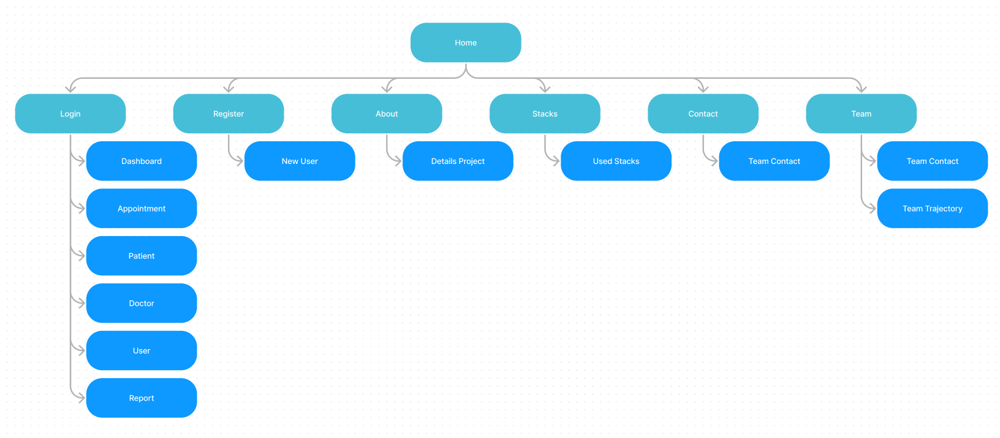
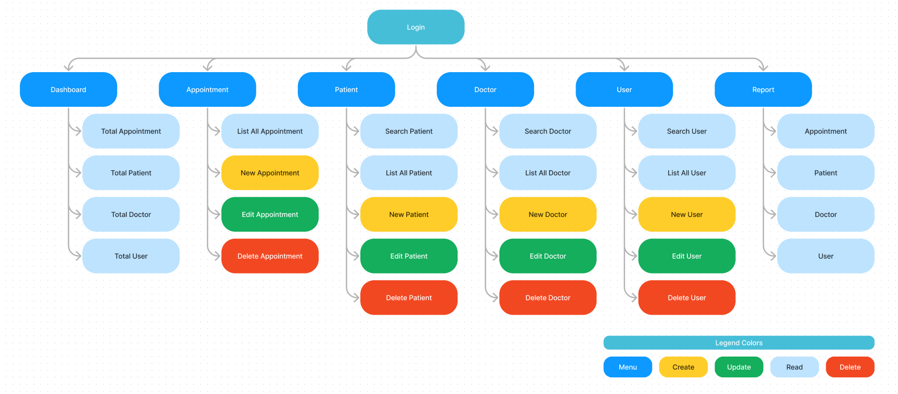
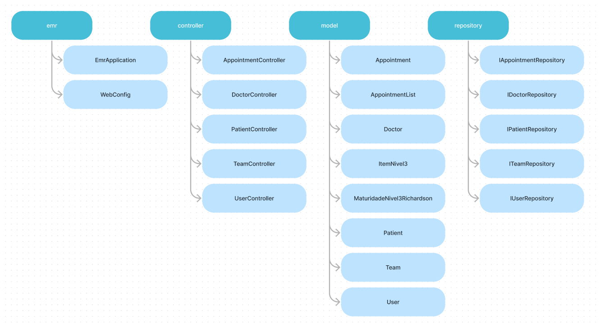
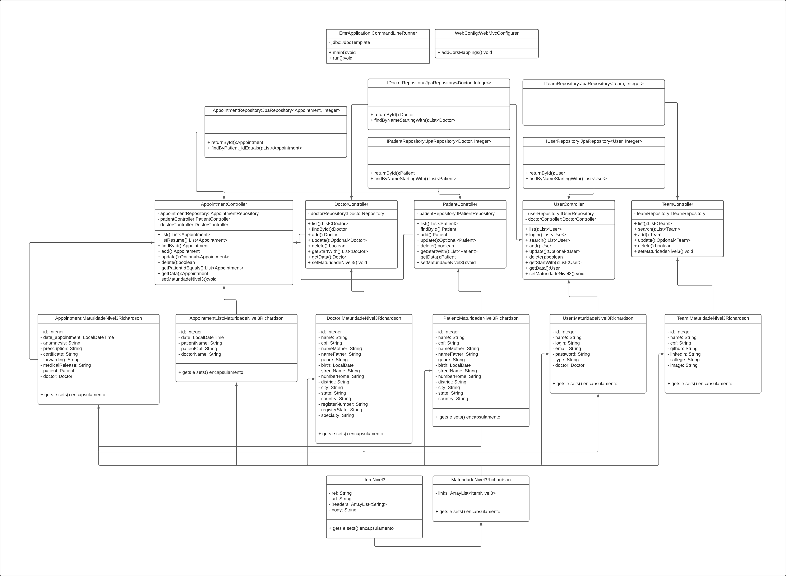
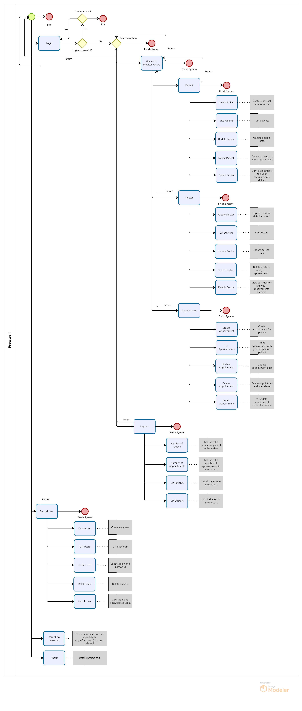
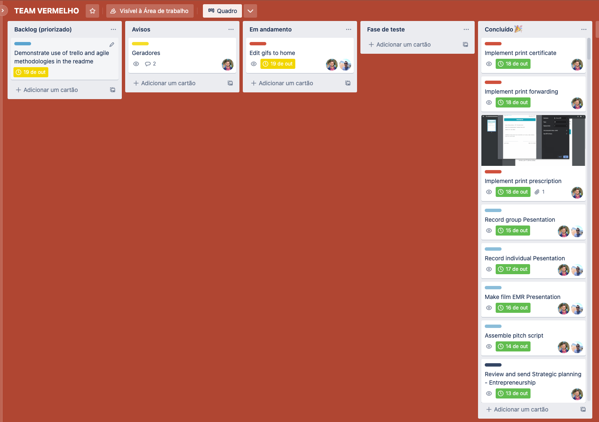

## **Project EMR - Electronic Medical Record**

## **🗃️ Table of Contents**

- [About the project]()
- [Front-end and Back-end diagrams]()
- [Application flowchart]()
- [Application in operation]()
- [Instructions for execute the Project]()
- [Technologies and Concepts]()
- [Author]()

---

## **🏥 About the project**

The EMR is an electronic medical record system that aims to deal with the management of small clinics and medical care offices.

Focused on the management of electronic medical records, it is able to store and manage information related to patients during the service cycles. With the history, it is possible for the health professional to know the personalities of the patient's framework and thus make better decisions.

Another important point is related to the issue of printed documentation, thus eliminating the possibility of errors caused by handwriting interpretation problems.

---
<br>

## 📈 **Application Structure Front-end**


> Front-end Application Structure

<br>



> Front-end Application Structure (Logged)

<br>

## 📈 **Application Structure Back-end**



> Back-end Application Structure

<br>



> Back-end Class Diagram

<br>

## 🔀&nbsp; **Application flowchart**

The system flow is based on the concept:
- Patient ➡️ Medical Record ➡️ Appointment 

<details>
    <summary><b>👈🏽 &nbsp; Click here to expand the flowchart </b></summary>



</details>

</br>

----

## ▶️  **Application in operation**


----

## **🔀 Application Sections**

<details>
    <summary>
        <b>🏥&nbsp; Start</b>
    </summary>

# 🏥&nbsp; Start

This is the set of home pages, consisting of the home, login and user registration.


## **Home**

The initial pages try to show a harmonic layout, using colors related to the health environment.
Through the home pages it is possible to navigate to the login, user registration, about and contact sections.

In the construction of the initial pages, the technologies of HTML, CSS and TS were used, through the Angular framework.

## **Login**

In the logic used in the login component, we have a page that is capable of re-rendering two components, which may or may not be called based on a defined business rule to identify whether there is a default login or registration of a new user.

In the login component there is a complete logic developed to validate attempts to enter the system. The component has a method capable of communicating with the backend and verifying the users registered in the database (MySql). Once the communication has been carried out, there is a method that verifies the inputs and allows or not the users to enter the system.

If so, the component sends to the service responsible for the system a boolean that says if there is an active login and for a string variable the name of the active user.

## **Record User**

The registration component is rendered on a page prepared to show it or the login component.

The logic used communicates with the back-end and through the User class, UserController and the IUserRepository interface manages the information and persists the data in the database (MySql), all through a Spring Boot.

</details>

<details>
    <summary>
        <b>🩺&nbsp; Appointment CRUD</b>
    </summary>

## 🩺&nbsp; Appointment


The appointments section is the part where the patient appointments data is listed, created, edited and deleted. Here you can find information regarding each service performed.

The business rule here is based on two components in Angular. The first component (appointment) is responsible for presenting a list interface with inputs for searching and inserting new users. The second component (new-appointment) consists of a group of inputs that capture patient information.

There is a service in Angular (appointment.service.ts) responsible for making requests to the back-end (Spring) where it handles the information and returns the requested data.

Regarding the back-end responsible for the services, a Controller class (AppointmentController), a Model class (Appointment) and an interface responsible for the repository (IAppointmentRepository) are involved.

The Appointment class is a class that inherits another class MaturityLevel3Richardson, responsible for implementing the characteristics necessary for a maturity level 3 API. It also implements the attributes necessary for a service and is linked to the database so that the Controller can access and manipulate the data in the database.

The IAppointmentRepository interface inherits the JpaRepository which is responsible for implementing the complete API for CRUD.

In the AppointmentController class are the CRUD methods related to the calls, through which the HTTP actions are executed with their respective returns and Status. Through these methods the data in the database, in this case MySql, are manipulated as defined.

</details>

<details>
    <summary>
        <b>😷&nbsp; Patient CRUD</b>
    </summary>

## 😷&nbsp; Patient


The patient section is the part where patient data is listed, created, edited and deleted. Here you can find personal information, in addition to the total list of services.

The business rule here is based on two components in Angular. The first component (patient) is responsible for presenting a list interface with inputs for searching and inserting new patients. The second component (new-patient) consists of a group of inputs that capture patient information.

There is a service in Angular (patient.service.ts) responsible for making requests to the back-end (Spring) where it handles the information and returns the requested data.

Regarding the back-end responsible for the services, a Controller class (PatientController), a Model class (Patient) and an interface responsible for the repository (IPatientRepository) are involved.

The Patient class is a class that inherits another MaturityLevel3Richardson class, responsible for implementing the necessary characteristics for a maturity level 3 API. It also implements the attributes necessary for a service and is linked to the database so that the Controller can access and manipulate the data in the database.

The IPatientRepository interface inherits the JpaRepository which is responsible for implementing the complete API for CRUD.

In the PatientController class are the CRUD methods related to the calls, through which the HTTP actions are performed with their respective returns and Status. Through these methods the data in the database, in this case MySql, are manipulated as defined.

</details>

<details>
    <summary>
        <b>👩‍🔬&nbsp; Doctor CRUD</b>
    </summary>

## 👩‍🔬&nbsp; Doctor


The doctors section is the part where the doctors data is listed, created, edited and deleted. Here you can find personal information, in addition to the total list of services.

The business rule here is based on two components in Angular. The first component (doctor) is responsible for presenting a list interface with inputs for searching and inserting new patients. The second component (new-doctor) consists of a group of inputs that capture patient information.

There is a service in Angular (doctor.service.ts) responsible for making requests to the back-end (Spring) where it handles the information and returns the requested data.

Regarding the back-end responsible for the services, a Controller class (DoctorController), a Model class (Doctor) and an interface responsible for the repository (IDoctorRepository) are involved.

The Doctor class is a class that inherits another class MaturityLevel3Richardson, responsible for implementing the characteristics necessary for a level 3 maturity API. It also implements the attributes necessary for a service and is linked to the database so that the Controller can access and manipulate the data in the database.

The IDoctorRepository interface inherits the JpaRepository which is responsible for implementing the complete API for CRUD.

In the DoctorController class are the CRUD methods related to the calls, through which the HTTP actions are executed with their respective returns and Status. Through these methods the data in the database, in this case MySql, are manipulated as defined.


</details>

<details>
    <summary>
        <b>👨🏻‍💻&nbsp; User CRUD</b>
    </summary>

## 👨🏻‍💻&nbsp; User


The users section is the part where user data is listed, created, edited and deleted. Here you can find your personal information.

The business rule here is based on two components in Angular. The first component (user) is responsible for presenting a list interface with inputs for searching and inserting new users. The second component (new-user) consists of a group of inputs that capture patient information.

There is a service in Angular (user.service.ts) responsible for making requests to the back-end (Spring) where it handles the information and returns the requested data.

Regarding the back-end responsible for the services, a Controller class (UserController), a Model class (User) and an interface responsible for the repository (IUserRepository) are involved.

The User class is a class that inherits another class MaturityLevel3Richardson, responsible for implementing the necessary characteristics for a maturity level 3 API. It also implements the attributes necessary for a service and is linked to the database so that the Controller can access and manipulate the data in the database.

The IUserRepository interface inherits the JpaRepository which is responsible for implementing the complete API for CRUD.

In the UserController class are the CRUD methods related to the calls, through which the HTTP actions are executed with their respective returns and Status. Through these methods the data in the database, in this case MySql, are manipulated as defined.

</details>

<details>
    <summary>
        <b>📊&nbsp; Reports</b>
    </summary>

## 📊&nbsp; Reports


The reports bring data referring to existing records in the database, that is, appointment, patient, doctor and user data.
They are listed in table format, displaying the most pertinent data.
All data is called through existing http methods within the Angular service, and sent through Spring controllers.

</details>

<br>

---

## **👨🏽‍🏫 Instructions for execute the Project**

## **Angular**

1. Make a project copy to your machine:
    - git clone [https://github.com/Red-Team-Entra21-Java/Entra21_Project_EMR_Angular_2022](https://github.com/Red-Team-Entra21-Java/Entra21_Project_EMR_Angular_2022)
    - Or a direct download from the page [HERE](https://github.com/Red-Team-Entra21-Java/Entra21_Project_EMR_Angular_2022).
2. Import the project into your VSCode.
        - If you don't have VSCode installed, watch this video I recorded teaching you how to install it. [VIEW VIDEO](https://youtu.be/82GnguThEAQ).
3. The node must be installed.
        - If you don't have node installed, go to the page and download it according to your operating system.
        - Node download page [HERE](https://nodejs.org/en/).
4.  Angular CLI must be installed.
        - If the Angular CLI is not installed it will be necessary to install it, for that node must be installed. Run the following command in your terminal:
    
    `npm install -g @angular/cli@latest`
    
    - After performing the previous steps, it will be necessary to install the dependencies used in the project, with the project page open in the terminal, run:
    
    `npm install`
    
    - With everything ready, just run the ng serve command and open the link provided in the browser of your choice.
    
    `ng serve`
    

## **Spring**

1. To run the project, Java JDK, Spring tools Suite and Maven must be installed and the environment variable defined.
2. To install Java JDK
    - Download JDK from the [site](https://www.oracle.com/java/technologies/downloads/#jdk19-windows)
    - Install the JDK exe File
    - Check the Directory ``C:\Program Files\Java\jdk-xxx`` if exists folder jdk
3. To install Maven
    - Download Maven [here](https://maven.apache.org/download.cgi)
    - Unzip file
    - Create a folder named maven in ``C:\``
    - Press the Windows key on the keyboard and type: "edit system variables". Click on the option that appears.
    - On the "Environment Variables" screen that will open, click the "New" button just below the part of the screen that says "environment Variables".
    - In the variable name and value fields, fill in: ``MAVEN_HOME`` and ``C:\maven\bin``, respectively. Confirm.
    - Check if it worked by opening a new prompt and typing ``mvn -version``
4. To install Spring Tools Suite
    - Download Spring Tools Suite from the [site](https://spring.io/tools)
    - Double click on the downloaded file to unzip.
    - Wait for unpacking.
    - A folder called ``sts-x.xx.x.RELEASE`` will be created in the unzip location.
    - Move the folder to a location of your choice.
    -Select the ``SpringToolSuite4`` application from inside the folder and create a shortcut on the desktop for easy access.
5. Make a project copy to your machine:
    - git clone [https://github.com/Red-Team-Entra21-Java/Entra21_Project_EMR_Spring_2022.git](https://github.com/Red-Team-Entra21-Java/Entra21_Project_EMR_Spring_2022.git)
    - Or a direct download from the page [HERE](https://github.com/Red-Team-Entra21-Java/Entra21_Project_EMR_Spring_2022.git).
6. Import the project into your Spring Tools Suite.
    - File -> Import -> Maven -> Existing Maven Projects -> Next -> Browse -> Select Downloaded Project -> Finish
7. A change to the application.properties file is required.
    - It is necessary to define your bank address, username and password.
    - By default these are the data, just when installing the database enter the same data for username and password (
user: root and password: Mysql123@ )
    ```` 
    spring.datasource.url=jdbc:mysql://localhost:3306/emr
    spring.datasource.username=root
    spring.datasource.password=Mysql123@
    ````

## **MySql**

1. To run the project, MySql just needs to be running with a database called emr, Spring itself will create the necessary tables.
2. To install MySql just follow this video I created demonstrating the steps. [Tutorial](https://youtu.be/0LJrh9Vuowg)
3. To create the database, open MySql Workbench
4. Access the local instance with your password.
5. Click on the fourth icon to create a new schema
6. Enter the bank name in the ``emr``` case. If you put another name, you need to change the settings in Spring to locate the bank.
7. Finally click apply.
8. Another way to do this is through the sql syntax with the command: 
    ````
    CREATE SCHEMA `emr`;
    ````
9. Another option is to start with a mass of data, just download it [here](https://github.com/Red-Team-Entra21-Java/Entra21_Project_EMR_Angular_2022/tree/development/data_base_mysql).
    - Go to the administration tab
    - Data Import/Restore
    - Import from Self-Contained File
    - Start Import
<br>

---

## **📚 Postman**

You can test the requests through Postman, importing the collections available [here](https://github.com/Red-Team-Entra21-Java/Entra21_Project_EMR_Spring_2022/tree/main/request_postman).

<br>

---

### **The back-end version of the project developed in SPRING can be found [HERE](https://github.com/Red-Team-Entra21-Java/Entra21_Project_EMR_Spring_2022).**

<br>


---

## **📚 Trello**

During the development process, the tasks were mapped and executed according to the planning carried out in trello, using the techniques of agile methodologies and kanban.



<br>
---


## **📚 Technologies and Concepts**

In this project we use Angular framework with HTML5, CSS3, Bootstrap and apply the following concepts:

1. Git
2. HTML
3. CSS
4. JAVA
5. Angular
6. Spring 
7. Agile Methodologies
8. Kanban

----

<br>

## 👨🏻‍🎓  **Authors**

<br>

<table>
<thead>
	<tr>
		<th>
            <a href="https://seiler-emerson.github.io/">
                
            </a>
        </th>
		<th>
            
        </th>
	</tr>
</thead>
<tbody>
	<tr>
		<td>
            <a href="https://www.linkedin.com/in/seileremerson/">
                
            </a>
        </td>
		<td>
            <a href="https://www.linkedin.com/in/welliton-borges-904331190/">
                
            </a>
        </td>
	</tr>
</tbody>
</table>

<br>

---